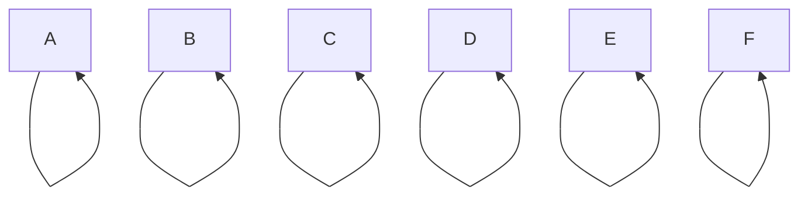
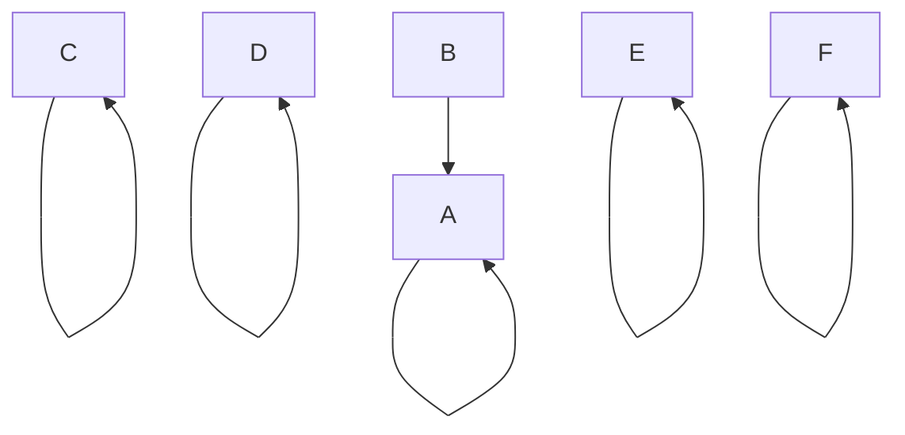
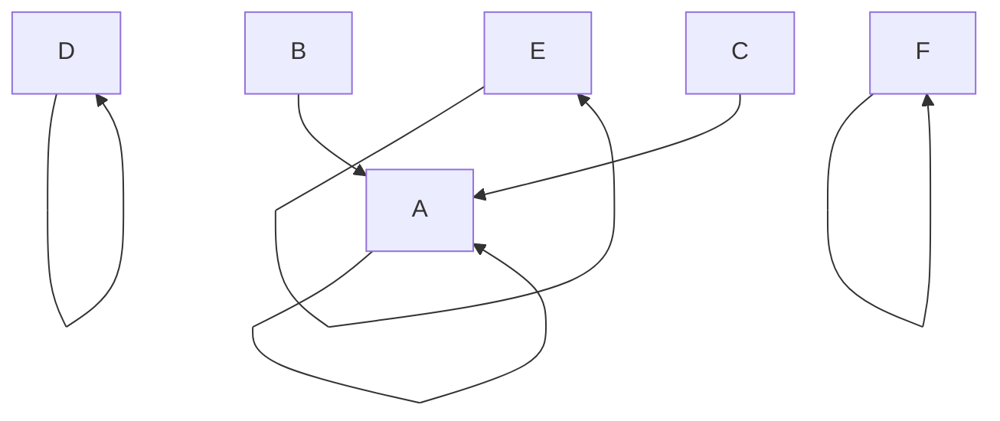
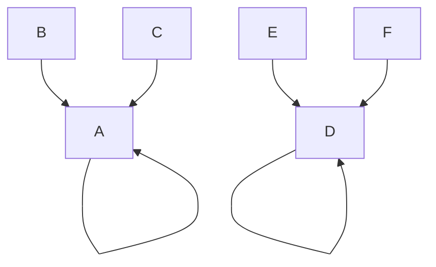
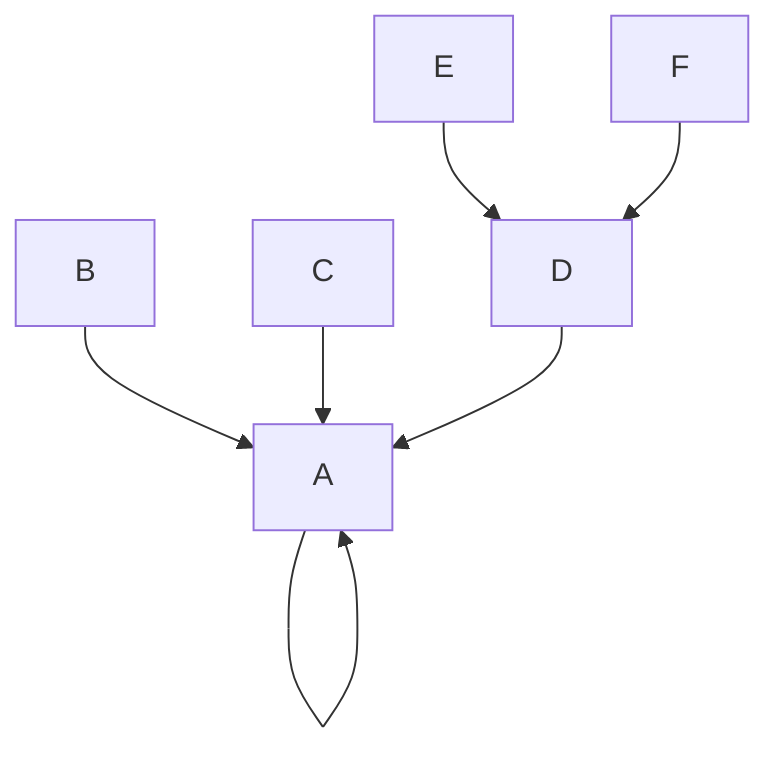
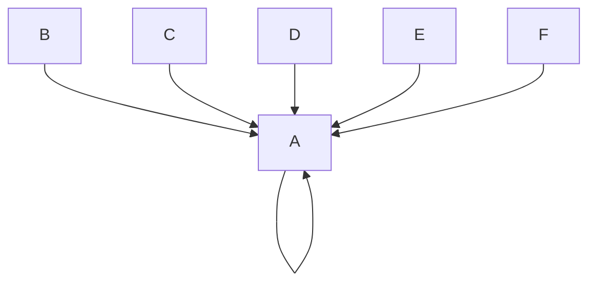
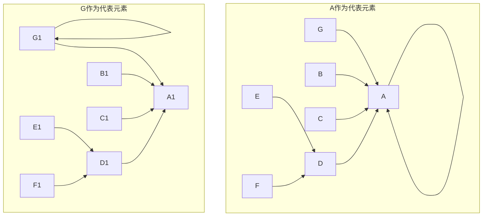

# 并查集

## 1. 概念

并查集是一种树型数据结构（在使用中常常以森林来表示），主要用于解决**元素分组**的问题，管理一系列**不相交的集合**，主要涉及两种操作：

- **合并（Union）**：把两个不相交的集合合并为一个集合
- **查询（Find）**：查询两个元素是否在同一个集合中

## 2. 举例

假设有六个不同的侠客，分别称为侠客`A`，`B`，`C`，`D`，`E`，`F`，一开始时他们各自为营（箭头指向自己）。



侠客 `A` 决定与侠客 `B` 比武，并且侠客 `A` 胜利了，侠客 `B` 成为了侠客 `A` 的小弟（即 `A` 是 `B` 的代表元素）。



侠客 `C` 想要和侠客 `B` 比武，但是侠客 `B` 表示要自己的老大侠客 `A`（代表元素）来撑腰，假设侠客 `A` 又赢了，侠客 `C` 也就成为了侠客 `A` 的小弟。



假设侠客 `D`，`E`，`F`也进行了一番比武，局势变成了这样：



最终侠客 `A` 和侠客 `D` 进行了比武，并且侠客 `A` 胜利，侠客 `A` 成为了真正的老大。



不难发现，这是一个树型结构（如果最后不进行合并就形成了森林）。并查集的关键就在于如何**合并元素**（比武认老大），如何查找**代表元素**（看看谁是老大）。

但是每次查找代表元素都需要从子节点一层一层往上找根节点，效率难免有些低。既然只关心代表元素，那么可以直接将子节点指向代表元素而不是父节点（如果父节点本身就是代表元素那就依然指向它），这称为**路径压缩**。



还有一个问题，两个拥有不同小弟数量的侠客应该怎么合并呢？如果按照图 `G作为代表元素` 来进行合并，在不使用路径压缩时会增加树的深度，在使用路径压缩时也会增加查找所用的时间，所以按照图 `A作为代表元素` 来进行合并更为合理。因此需要**按秩（树的深度）合并**。



## 3. 代码模板

```java
public class DisjointSet {
    /**
     * 存储每个节点, 存储的值应该指向代表元素
     */
    private int[] nodes;

    /**
     * 总的集合数量, 随着节点的合并,这个值会逐渐减小
     */
    private int size;

    /**
     * 各个集合中的节点个数
     */
    private int[] countsOfCollection;

    /**
     * 构造方法
     *
     * <p>需要给定一个初始集合数量</p>
     *
     * @param size 集合数量
     */
    public DisjointSet(int size) {
        // 集合数量
        this.size = size;
        // 初始化数组
        // 因为这个时候还没有将节点合并, 所以数量就等于默认的集合数量
        this.nodes = new int[size];
        this.countsOfCollection = new int[size];
        // 对数组赋值, 初始的代表元素就应该是自身, 在合并后代表元素可能不会是自身
        // 初始的节点个数都是1
        for (int i = 0; i < size; i++) {
            nodes[i] = i;
            countsOfCollection[i] = 1;
        }
    }

    /**
     * 获取总的集合数量
     *
     * @return 集合数量
     */
    public int getSize() {
        return size;
    }

    /**
     * 找到{@code node}节点所在集合中的代表元素
     *
     * @param node 某一节点
     * @return 所在集合的代表元素
     */
    public int find(int node) {
        // 递归查找集合中的代表元素
        if (node != nodes[node]) {
            nodes[node] = find(nodes[node]);
        }
        // 递归结束条件: 代表元素就是自身
        return nodes[node];
    }

    /**
     * 将{@code node1}所在的集合与{@code node2}所在的集合合并起来
     *
     * @param node1 节点一
     * @param node2 节点二
     */
    public void union(int node1, int node2) {
        // 找到两个节点所在集合的代表元素
        int root1 = find(node1);
        int root2 = find(node2);

        // 如果代表元素相同,即两节点在一个集合内
        // 那么就不需要合并了,直接返回即可
        if (root1 == root2) {
            return;
        }

        /*
         * 如果集合一的节点数量少于集合二的节点数量
         * 那么将节点二作为代表元素, 同时集合一的节点依附到集合二中
         * 反之亦然
         */
        if (countsOfCollection[root1] < countsOfCollection[root2]) {
            nodes[root1] = root2;
            countsOfCollection[root2] += countsOfCollection[root1];
        } else {
            nodes[root2] = root1;
            countsOfCollection[root1] += countsOfCollection[root2];
        }

        // 因为合并了，所以集合数量减少1
        size--;
    }
}
```

